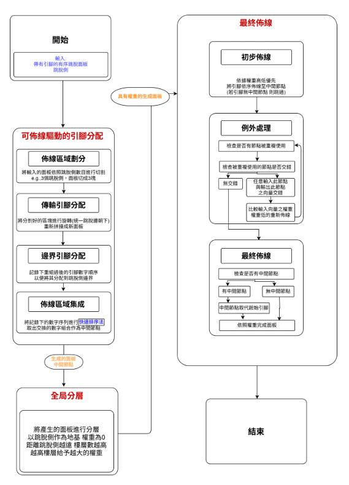
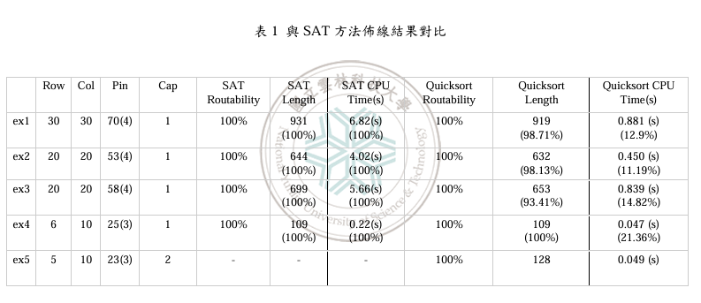
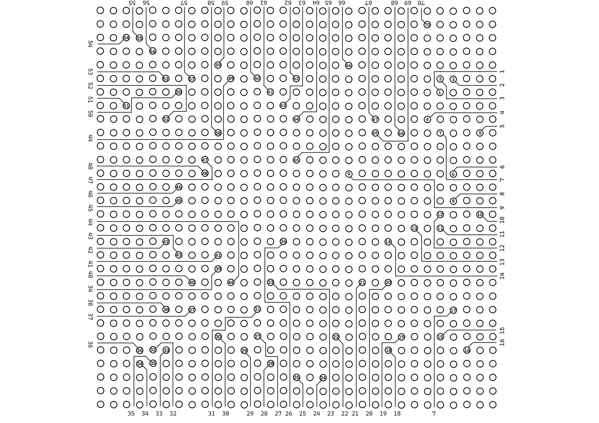

# Ordered Escape Routing Research

## Master's Thesis Project

**Thesis Title:** Quick Sort and Hierarchical Routing Completion for Ordered Escape Routing

Master's thesis research conducted at National Yunlin University of Science and Technology.

---

## Keywords

- Ordered Escape Routing
- VLSI Design Automation
- Routing Optimization
- Algorithm Design
- Quick Sort
- Hierarchical Routing
- Capacity-Constrained Routing

---

## Overview

Ordered Escape Routing (OER) is a critical problem in VLSI and PCB design, where routing paths must preserve predefined ordering constraints while maximizing routability.

Traditional SAT-based approaches can achieve high routability but often require significant computational resources.

This research proposes a routing framework that replaces SAT-based optimization with a Quick Sort based routing strategy and a hierarchical routing methodology. The proposed method achieves 100% routability on tested benchmarks while significantly reducing CPU execution time.

---

## Research Workflow

The proposed routing framework consists of three major stages:

1. Routability-Driven Pin Assignment
2. Global Layer Assignment
3. Final Routing Completion

### Workflow Diagram

The following diagram illustrates the complete routing framework proposed in this research.



---

## Research Objectives

The goals of this research are:

- Improve routing efficiency for high-density pin arrays
- Achieve 100% routability under capacity constraints
- Reduce computational complexity compared with SAT-based methods
- Provide a scalable routing solution for Ordered Escape Routing problems

---

## Proposed Method

### 1. Routability-Driven Pin Assignment

The pin array is partitioned into multiple routing regions.

A Quick Sort based strategy is used to efficiently determine transition pin ordering while preserving ordered routing constraints.

Main procedures include:

- Routing region partitioning
- Transition pin assignment
- Boundary pin assignment
- Routing region integration

---

### 2. Global Layer Assignment

After pin assignment, routing paths are assigned hierarchical priorities.

The global layer assignment process determines routing order and reduces potential routing conflicts.

---

### 3. Final Routing Completion

Routing is completed from higher-priority layers to lower-priority layers.

A hierarchical routing strategy is applied to avoid crossing violations while preserving ordered routing requirements.

---

## Research Contributions

- Replaced SAT-based optimization with a Quick Sort based strategy
- Proposed a hierarchical routing methodology for Ordered Escape Routing
- Achieved 100% routability on tested benchmark cases
- Reduced CPU runtime compared with traditional SAT-based approaches
- Supported routing scenarios with capacity constraints greater than one

---

## Experimental Results

The proposed Quick Sort based routing framework achieved the same routability as SAT-based approaches while significantly reducing computational runtime.

### SAT vs Quick Sort Comparison



### Benchmark Summary

| Benchmark | SAT Routability | Proposed Method Routability | SAT CPU Time | Proposed Method CPU Time |
|---|---:|---:|---:|---:|
| ex1 | 100% | 100% | 6.82 s | 0.881 s |
| ex2 | 100% | 100% | 4.02 s | 0.450 s |
| ex3 | 100% | 100% | 5.66 s | 0.839 s |
| ex4 | 100% | 100% | 0.22 s | 0.047 s |
| ex5 | N/A | 100% | N/A | 0.049 s |

### Key Findings

- Achieved 100% routability on all tested benchmark cases
- Reduced CPU runtime from several seconds to less than one second in most benchmark cases
- Successfully handled capacity-constrained benchmarks that SAT-based methods did not complete
- Improved scalability for high-density routing problems

---

## Routing Example

The following example demonstrates how the proposed method transforms an unrouted pin panel into a fully routed solution while preserving ordered routing constraints.

### Input Panel


### Final Routing Result



---

## Research Areas

- Ordered Escape Routing (OER)
- Routing Optimization
- Algorithm Design
- VLSI Design Automation
- PCB Routing
- Computational Optimization

---

## Tools and Technologies

- C++
- Algorithm Design
- Optimization Techniques
- Routing Analysis
- VLSI Design Automation

---

## Thesis Information

**Author:** Wei-Lun Xu

**Advisor:** Dun-Wei Cheng, Ph.D.

**Department:** Computer Science and Information Engineering

**University:** National Yunlin University of Science and Technology

**Year:** 2025

---

## Thesis Document

The complete master's thesis can be added to this repository as a PDF document.

```text
thesis.pdf
